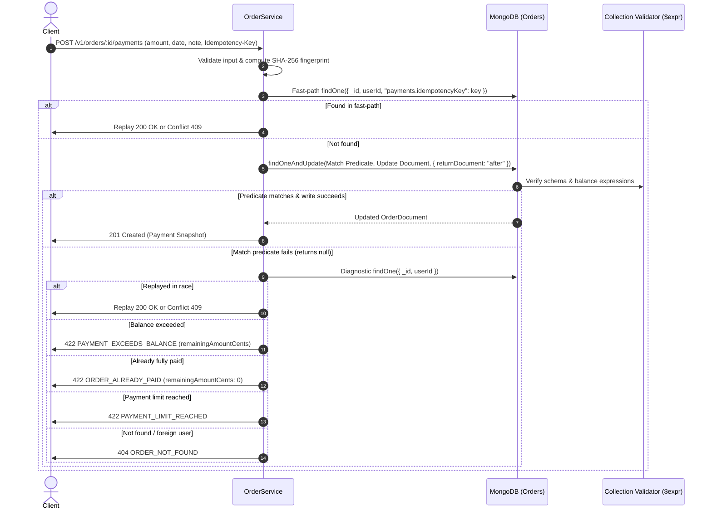

# Backend Concurrency, Atomic Defenses, Idempotency & Verification Analysis

**Author:** explorer_m3_concurrency_1  
**Date:** 2026-08-15  
**Mission:** Analyze backend implementation for atomic concurrency defenses, idempotency replay, balance validations, error envelopes, and design Tier 3 / Tier 4 verification test architecture.

---

## 1. Executive Summary

CrossVal Orders & Settlements implements single-document atomic write defenses using MongoDB's document-level ACID guarantees, strict JSON Schema + `$expr` collection validators, and application-level conditional update predicates. The system handles race conditions without multi-document distributed locking or external queues by delegating serialization to MongoDB's WiredTiger storage engine.

Key architectural properties confirmed in this analysis:
1. **Atomic Write Predicates**: `recordPayment` relies on a single `findOneAndUpdate` call matching ownership (`userId`), remaining balance (`balanceDueCents >= amountCents`), ledger capacity (`paymentCount < 1000`), and idempotency uniqueness (`payments: { $not: { $elemMatch: { idempotencyKey } } }`).
2. **Deterministic Idempotency Replay**: Payments are fingerprinted using a SHA-256 hash of `[amountCents, paymentDate, note]`. Matching keys with identical fingerprints return `200 OK` + `Idempotency-Replayed: true` with the historical payment snapshot; conflicting fingerprints return `409 IDEMPOTENCY_KEY_REUSED`.
3. **Strict Immutability Guards**: Both `PATCH /orders/:id` and `DELETE /orders/:id` enforce `{ paymentCount: 0 }` in their conditional match predicates (`findOneAndUpdate` and `deleteOne`), locking an order permanently upon the commitment of even a single 1-cent payment.
4. **Defense-in-Depth Schema Invariants**: The MongoDB collection validator (`$expr`) enforces `balanceDueCents <= totalAmountCents`, `paymentCount === size(payments)`, and `totalAmountCents - balanceDueCents === sum(payments.amountCents)` at the database engine level.

---

## 2. Analysis 1: Atomic `findOneAndUpdate` Execution & Match Predicate

### 2.1 Code Reference
- **File**: `apps/api/src/modules/orders/service.ts` (lines 227–346)
- **Domain Helper**: `apps/api/src/modules/orders/domain.ts` (lines 77–113)
- **Database Validator**: `apps/api/src/db/validators/collection-validators.ts` (lines 220–234)

### 2.2 Execution Flow of `recordPayment`



### 2.3 The Exact Match Predicate

In `apps/api/src/modules/orders/service.ts` (lines 266–272):

```typescript
const updatedOrder = await orders.findOneAndUpdate(
  {
    _id: orderId,
    userId,
    balanceDueCents: { $gte: draft.amountCents },
    paymentCount: { $lt: maximumPaymentsPerOrder },
    payments: { $not: { $elemMatch: { idempotencyKey } } },
  },
  {
    $inc: {
      balanceDueCents: -draft.amountCents,
      paymentCount: 1,
    },
    $push: { payments: payment },
    $set: { updatedAt: timestamp },
  },
  { returnDocument: "after" },
);
```

#### Breakdown of Match Predicate Elements:
| Predicate Filter | Role & Safety Invariant |
|------------------|-------------------------|
| `_id: orderId` | Targets the specific order aggregate document. |
| `userId` | Enforces tenant authorization and ownership directly in the write filter. Prevents cross-tenant writes even under race conditions. |
| `balanceDueCents: { $gte: draft.amountCents }` | Guarantees the balance due is strictly sufficient to cover this payment. Under concurrent writes, WiredTiger evaluates this after locking the document; if another payment committed first and reduced `balanceDueCents`, this predicate immediately fails without debiting. |
| `paymentCount: { $lt: maximumPaymentsPerOrder }` | Bounds the embedded array growth (max 1,000 subdocuments) to prevent unbounded document size violations (16MB BSON limit). |
| `payments: { $not: { $elemMatch: { idempotencyKey } } }` | Guarantees that no duplicate payment with this idempotency key is appended to the order ledger. |

### 2.4 Diagnostic Post-Miss Analysis

When `findOneAndUpdate` returns `null`, the backend does not speculate. It performs an authoritative diagnostic read `orders.findOne({ _id: orderId, userId })` (`service.ts:291`):
1. **Order does not exist or belongs to another user** (`currentOrder === null`): Throws `404 ORDER_NOT_FOUND`.
2. **Concurrent winner had the same idempotency key** (`replayedPayment !== undefined`): Calls `replayOrConflict(...)` returning either `200 OK` (if identical fingerprint) or `409 IDEMPOTENCY_KEY_REUSED`.
3. **Ledger full** (`currentOrder.paymentCount >= 1000`): Throws `422 PAYMENT_LIMIT_REACHED`.
4. **Order already settled** (`currentOrder.balanceDueCents === 0`): Throws `422 ORDER_ALREADY_PAID` with `{ remainingAmountCents: 0 }`.
5. **Partial overdraft** (`currentOrder.balanceDueCents < draft.amountCents`): Throws `422 PAYMENT_EXCEEDS_BALANCE` with `{ remainingAmountCents: currentOrder.balanceDueCents }`.
6. **Transient write failure fallback**: Throws `503 PAYMENT_TEMPORARILY_UNAVAILABLE`.

---

## 3. Analysis 2: Duplicate Idempotency Replay Mechanics

### 3.1 Idempotency Key Specification
- Passed via HTTP header `Idempotency-Key`.
- Validated via regex `/^[0-9a-fA-F]{8}-[0-9a-fA-F]{4}-[1-8][0-9a-fA-F]{3}-[89abAB][0-9a-fA-F]{3}-[0-9a-fA-F]{12}$/` (`contracts/orders.ts:74–78`).
- Normalized: Trimmed and converted to lowercase.

### 3.2 Request Fingerprinting Algorithm
Defined in `apps/api/src/modules/orders/domain.ts` (lines 100–105):
```typescript
const normalizedNote = input.note === undefined ? "" : normalizeWhitespace(input.note);
const note = normalizedNote.length === 0 ? null : normalizedNote;
const requestFingerprint = createHash("sha256")
  .update(JSON.stringify([input.amountCents, input.paymentDate, note]))
  .digest("hex");
```
- Includes: `amountCents` (integer cents), `paymentDate` (`YYYY-MM-DD`), `note` (whitespace normalized).
- Ignores trivial whitespace variations in `note` (e.g. `"  Wire   Transfer  "` normalizes to `"Wire Transfer"`).

### 3.3 Replay vs Conflict Behavior Matrix

| Incoming Request State | Existing Stored Payment | Response Status | Response Header | Error Code / Body |
|------------------------|-------------------------|-----------------|-----------------|-------------------|
| New Key `K1` | No payment with `K1` | `201 Created` | (None) | `{ data: { payment, order } }` |
| Duplicate Key `K1`, **Same Fingerprint** | Payment with `K1` (`stored.fingerprint === incoming.fingerprint`) | `200 OK` | `Idempotency-Replayed: true` | Original `{ data: { payment, order } }` as of that payment |
| Duplicate Key `K1`, **Different Amount** | Payment with `K1` (`stored.fingerprint !== incoming.fingerprint`) | `409 Conflict` | (None) | `IDEMPOTENCY_KEY_REUSED` |
| Duplicate Key `K1`, **Different Date** | Payment with `K1` (`stored.fingerprint !== incoming.fingerprint`) | `409 Conflict` | (None) | `IDEMPOTENCY_KEY_REUSED` |
| Duplicate Key `K1`, **Different Note** | Payment with `K1` (`stored.fingerprint !== incoming.fingerprint`) | `409 Conflict` | (None) | `IDEMPOTENCY_KEY_REUSED` |

### 3.4 Snapshot Integrity on Historical Replay
When a historical payment is replayed (`apps/api/src/modules/orders/mapper.ts:64–94`):
- `toRecordPaymentResult(order, payment)` computes `committedPaymentCount = paymentIndex + 1`.
- Slices `order.payments.slice(0, committedPaymentCount)` to calculate the exact `paidAmountCents` and `balanceDueCents` that existed when that payment occurred.
- This ensures an idempotent replay of Payment #1 does not return the updated balance resulting from subsequent Payment #2.

---

## 4. Analysis 3: Order Edit and Deletion Guards Against Paid Orders

### 4.1 Order Replacement (`PATCH /orders/:id`)
- **File**: `apps/api/src/modules/orders/service.ts` (lines 180–213)
- **MongoDB Operation**:
  ```typescript
  getCollections(this.database).orders.findOneAndUpdate(
    { _id: orderId, userId, paymentCount: 0 },
    {
      $set: {
        customerName: draft.customerName,
        customerNameNormalized: draft.customerNameNormalized,
        dueDate: draft.dueDate,
        lineItems: draft.lineItems.map(...),
        totalAmountCents: draft.totalAmountCents,
        balanceDueCents: draft.totalAmountCents,
        updatedAt: timestamp,
      },
    },
    { returnDocument: "after" },
  );
  ```
- **Guard Mechanism**:
  - Filter strictly matches `paymentCount: 0`.
  - If an order has even 1 committed payment (`paymentCount >= 1`), `findOneAndUpdate` matches 0 documents and returns `null`.
  - Diagnosed in `throwConditionalMiss`: checks `order.paymentCount > 0` and throws `409 ORDER_LOCKED_AFTER_PAYMENT`.

### 4.2 Order Deletion (`DELETE /orders/:id`)
- **File**: `apps/api/src/modules/orders/service.ts` (lines 215–225)
- **MongoDB Operation**:
  ```typescript
  getCollections(this.database).orders.deleteOne({
    _id: orderId,
    userId,
    paymentCount: 0,
  });
  ```
- **Guard Mechanism**:
  - Filter strictly matches `paymentCount: 0`.
  - If `deletedCount === 0`, `throwConditionalMiss` checks if `paymentCount > 0` and throws `409 ORDER_LOCKED_AFTER_PAYMENT`.
  - Unpaid orders are deleted with `204 No Content`.

### 4.3 Race Condition Analysis: Edit / Delete vs Concurrent Payment
- **Case A: Payment commits before Edit**:
  - Payment updates `paymentCount` from `0` to `1`.
  - Edit's `findOneAndUpdate` predicate `{ paymentCount: 0 }` fails.
  - Edit returns `409 ORDER_LOCKED_AFTER_PAYMENT`. Order items and payment remain intact.
- **Case B: Edit commits before Payment**:
  - Edit updates line items, `totalAmountCents`, and `balanceDueCents` to new values, leaving `paymentCount: 0`.
  - Payment's `findOneAndUpdate` evaluates against the new `balanceDueCents`.
  - If `newBalance >= paymentAmount`, payment succeeds on new total. If not, payment returns `422 PAYMENT_EXCEEDS_BALANCE`.
- **Case C: Payment commits before Delete**:
  - Payment updates `paymentCount` to `1`.
  - Delete's `deleteOne` matches 0 rows and returns `409 ORDER_LOCKED_AFTER_PAYMENT`. Order and payment remain intact.
- **Case D: Delete commits before Payment**:
  - Document is removed from `orders` collection.
  - Payment's `findOneAndUpdate` matches 0 rows.
  - Diagnostic read finds `null` and returns `404 ORDER_NOT_FOUND`.

---

## 5. Analysis 4: Stress-Testing Concurrent Race Conditions

To prove atomic correctness, we need specific test scenarios executing parallel requests through multiple independent MongoDB clients.

### 5.1 Race Condition Scenarios Catalogue

```text
+-----------------------------------------------------------------------------------------+
|                               CONCURRENCY TEST MATRIX                                   |
+-----------------------------------------------------------------------------------------+
| Scenario                     | Setup (Balance)   | Concurrent Actions   | Expected Outcome |
+------------------------------+-------------------+----------------------+------------------+
| 1. Parallel Overdraft        | Balance: $100.00  | Req A: $80.00        | Winner: 201 ($80)|
|    (Two payments > balance)  | (10,000 cents)    | Req B: $60.00        | Loser: 422 ($60) |
|                              |                   |                      | Final Bal: $20   |
+------------------------------+-------------------+----------------------+------------------+
| 2. Exact Balance Split       | Balance: $100.00  | Req A: $40.00        | Req A: 201       |
|    (Two payments = balance)  | (10,000 cents)    | Req B: $60.00        | Req B: 201       |
|                              |                   |                      | Final Bal: $0    |
+------------------------------+-------------------+----------------------+------------------+
| 3. Duplicate Key Stampede    | Balance: $500.00  | 5x parallel requests | Exactly 1x 201   |
|    (Same Key & Payload)      | (50,000 cents)    | with same UUID & $50 | 4x 200 (Replay)  |
|                              |                   |                      | Final Bal: $450  |
+------------------------------+-------------------+----------------------+------------------+
| 4. Conflicting Key Stampede  | Balance: $500.00  | Req A: Key K, $100   | Winner: 201      |
|    (Same Key, Diff Amount)   | (50,000 cents)    | Req B: Key K, $150   | Loser: 409 Conf. |
|                              |                   |                      | Final Bal: $400  |
+------------------------------+-------------------+----------------------+------------------+
| 5. Payment vs Edit Race      | Balance: $100.00  | Req A: Pay $30.00    | Either Pay first |
|                              | Unpaid (count 0)  | Req B: Edit to $150  | (201 & 409) or   |
|                              |                   |                      | Edit first       |
|                              |                   |                      | (200 & 201)      |
+------------------------------+-------------------+----------------------+------------------+
| 6. Payment vs Delete Race    | Balance: $100.00  | Req A: Pay $30.00    | Either Pay first |
|                              | Unpaid (count 0)  | Req B: Delete order  | (201 & 409) or   |
|                              |                   |                      | Del first (204 & |
|                              |                   |                      | 404)             |
+------------------------------+-------------------+----------------------+------------------+
| 7. High-Contention Stampede  | Balance: $1.00    | 10x parallel calls   | Exactly 5x 201   |
|    (10 parallel requests)    | (100 cents)       | each attempting $0.20| Exactly 5x 422   |
|                              |                   |                      | Final Bal: $0.00 |
+------------------------------+-------------------+----------------------+------------------+
```

---

## 6. Analysis 5: Test Architecture & Test Cases for Tier 3 & Tier 4 Verification

### 6.1 Test Infrastructure Architecture

```text
                       +-----------------------------------+
                       |    Vitest Test Runner Process     |
                       +-----------------------------------+
                                   |           |
             +---------------------+           +---------------------+
             |                                                       |
+--------------------------+                               +--------------------------+
|  Primary Client Session  |                               | Concurrent Client Session|
|  (Supertest -> Express)  |                               | (Supertest -> Express)   |
+--------------------------+                               +--------------------------+
             |                                                       |
             |  MongoClient Socket A                                 |  MongoClient Socket B
             +---------------------+           +---------------------+
                                   |           |
                       +-----------------------------------+
                       |   MongoDB Server (Real Atlas/DB)  |
                       | - Collection JSONSchema Validator |
                       | - $expr Balance Equality Checks   |
                       | - Unique / Compound Indexes       |
                       +-----------------------------------+
```

#### Test Execution Design Rules:
1. **Real Database Isolation**: Each suite provisions a dedicated database (`crossval_e2e_<uuid>_test`) and runs migrations before test cases.
2. **Dual-Client / Multi-Socket Concurrency**: Use two or more distinct `MongoClient` and Express `createApp` instances (`primaryApp`, `concurrentApp`) to bypass HTTP agent pooling and ensure separate TCP sockets and MongoDB connection pool checkouts.
3. **Promise Barrier Dispatch**: Use `Promise.all([ ... ])` to initiate simultaneous I/O calls over the wire.
4. **Post-Test Invariant Verification**: Direct database inspection with `findOne` to verify:
   - `balanceDueCents === totalAmountCents - sum(payment.amountCents)`
   - `paymentCount === payments.length`
   - Exact array lengths and chronological ordering.

---

### 6.2 Tier 3: Cross-Feature Combinations (Pairwise Interaction Test Suite)

| Test ID | Test Name | Cross-Feature Interaction | Verification Steps & Assertions |
|---------|-----------|---------------------------|----------------------------------|
| **T3-01** | `Lock Enforcement: Partial Payment Locks Edit and Delete` | Order Creation + Payment Recording + Order Mutation / Deletion | 1. Create order with 3 items ($300.00).<br>2. Record partial payment of $100.00 (201).<br>3. Attempt `PATCH /v1/orders/:id` → 409 `ORDER_LOCKED_AFTER_PAYMENT`.<br>4. Attempt `DELETE /v1/orders/:id` → 409 `ORDER_LOCKED_AFTER_PAYMENT`.<br>5. Inspect DB: order items unchanged, 1 payment recorded, balance is $200.00. |
| **T3-02** | `Draft Edit Recalculation followed by Full Settlement` | Order Creation + Order Replacement (Total Recalculation) + Payment Settlement | 1. Create order for $100.00.<br>2. Replace with 2 line items totalling $250.00 (200).<br>3. Verify recalculated `balanceDueCents === 25000`.<br>4. Record $250.00 payment (201).<br>5. Verify status is `paid`, `balanceDueCents === 0`.<br>6. Overpayment attempt of $0.01 → 422 `ORDER_ALREADY_PAID`. |
| **T3-03** | `Idempotent Replay Impact on Portfolio Summary Metrics` | Payment Idempotency + Portfolio Summary Aggregations | 1. Query baseline `/v1/orders/summary`.<br>2. Create $500.00 order.<br>3. Record $200.00 payment with key `K1`.<br>4. Verify summary: collected += $200, outstanding += $300.<br>5. Replay payment with key `K1` → 200 `Idempotency-Replayed: true`.<br>6. Verify summary is identical (no double-counting). |
| **T3-04** | `Cross-Tenant Payment and Mutation Isolation` | Ownership Authorization + Payment Creation + Order CRUD | 1. User A creates Order A ($100.00).<br>2. User B attempts `POST /orders/:idA/payments` → 404 `ORDER_NOT_FOUND`.<br>3. User B attempts `GET`, `PATCH`, `DELETE` on Order A → All return 404.<br>4. User A records payment on Order A → 201 Created. |
| **T3-05** | `Overdue Boundary & Settlement Status Precedence` | Date-Based Status Derivation (`overdue`) + Payment Settlement | 1. Create order with `dueDate = yesterday` ($100.00) → status `overdue`.<br>2. Partial payment of $40.00 → status remains `overdue` (balance > 0).<br>3. Full settlement of $60.00 → status transitions to `paid` (`paid` takes precedence over past `dueDate`).<br>4. Filter queries `?status=paid` vs `?status=overdue` match correctly. |
| **T3-06** | `Search, Filter & Pagination Reconciliation on Payment` | Order Querying (Search, Status Filter, Pagination) + Payment Recording | 1. Create 15 orders for customer "Acme".<br>2. Query page 2 (`?page=2&pageSize=10`) → 5 items.<br>3. Pay one order on page 2 in full.<br>4. Query `?status=paid&search=Acme` → 1 item returned, pagination `totalItems: 1, totalPages: 1`. |
| **T3-07** | `Concurrent Duplicate Replay Interleaved with Competing Payment` | Payment Idempotency Race + Concurrent Balance Race | 1. Order with $100.00 balance.<br>2. Fire 3 concurrent requests: Req 1 (Key K1, $70), Req 2 (Key K1, $70 identical), Req 3 (Key K2, $50).<br>3. Assert: K1 commits once (201) and replays once (200). K2 fails with 422 `PAYMENT_EXCEEDS_BALANCE`.<br>4. Final balance: $30.00, exactly 1 payment in DB. |

---

### 6.3 Tier 4: Real-World Workload Scenarios & Hardening Test Suite

| Test ID | Test Name | Workload Context | Verification Steps & Assertions |
|---------|-----------|------------------|----------------------------------|
| **T4-01** | `Core Assignment Flow ($1,000 → $400 → $600 → Reject $1 Overpayment)` | Primary Reviewer Assignment Scenario | 1. Create multi-item order for $1,000.00.<br>2. Step 1: Record $400.00 partial payment with note → 201, status `partially_paid`, balance $600.00.<br>3. Step 2: Record $600.00 full settlement → 201, status `paid`, balance $0.00.<br>4. Step 3: Attempt $0.01 overpayment → 422 `ORDER_ALREADY_PAID`, `remainingAmountCents: 0`.<br>5. Step 4: Attempt $1.00 overpayment → 422 `ORDER_ALREADY_PAID`, `remainingAmountCents: 0`.<br>6. Check `GET /v1/orders/:id` → payments ordered newest-first ($600 then $400).<br>7. Direct DB inspection: payments array ordered chronological ($400 then $600). |
| **T4-02** | `Multi-User Concurrent Settlement Simulation` | Realistic Multi-Tenant Traffic | 1. Sign up User A and User B.<br>2. User A and User B concurrently create, replace, pay, and query orders across two MongoDB clients.<br>3. 10 total orders across both users with mixed pending, partial, paid, overdue states.<br>4. Verify zero cross-user leakage, perfect summary isolation, and 100% financial consistency. |
| **T4-03** | `High-Contention 10-Client Atomic Balance Stampede` | Maximum Race Condition Stress Test | 1. Create order with $1.00 (100 cents) total.<br>2. Launch 10 parallel payment requests from 10 distinct client handles, each attempting $0.20 (20 cents) with unique idempotency keys.<br>3. Assert: Exactly 5 requests return 201 Created ($1.00 total).<br>4. Assert: Exactly 5 requests return 422 (`PAYMENT_EXCEEDS_BALANCE` or `ORDER_ALREADY_PAID`).<br>5. Assert: DB document has `balanceDueCents === 0`, `paymentCount === 5`, `status === "paid"`. |
| **T4-04** | `Full Order Lifecycle Business Journey` | End-to-End User Journey | 1. Create Order #1 draft ($200.00).<br>2. Edit Order #1 to $350.00 (PATCH 200).<br>3. Cancel/Delete Order #1 (DELETE 204).<br>4. Create Order #2 ($500.00).<br>5. Pay Installment 1: $150.00 (201).<br>6. Verify Edit and Delete now fail (409).<br>7. Replay Installment 1 (200 Replayed).<br>8. Pay Installment 2: $350.00 (201 Paid).<br>9. Reject Overpayment attempt (422).<br>10. Verify portfolio summary and full audit trail. |

---

## 7. Synthesis & Implementation Checklist for Milestone M3

To complete Milestone M3 testing:
1. **Implement Tier 3 integration test suite** in `apps/api/tests/orders/tier3-combinations.integration.test.ts` implementing test cases `T3-01` through `T3-07`.
2. **Implement Tier 4 workload test suite** in `apps/api/tests/orders/tier4-workloads.integration.test.ts` implementing test cases `T4-01` through `T4-04`.
3. **Execute test runner against real MongoDB Atlas/test instance**:
   - `pnpm --filter @crossval/api test:integration`
   - Verify 100% pass rate with clean teardown.
4. **Audit schema & indexing**:
   - Confirm all compound indexes (`orders_user_created_at`, `orders_user_due_balance`, etc.) support query plans.
   - Confirm collection validators enforce `$expr` financial constraints.
