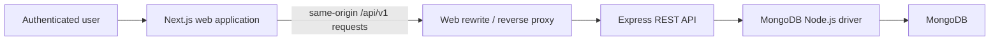
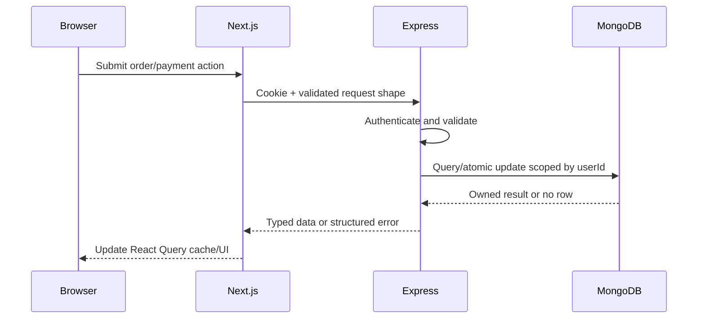
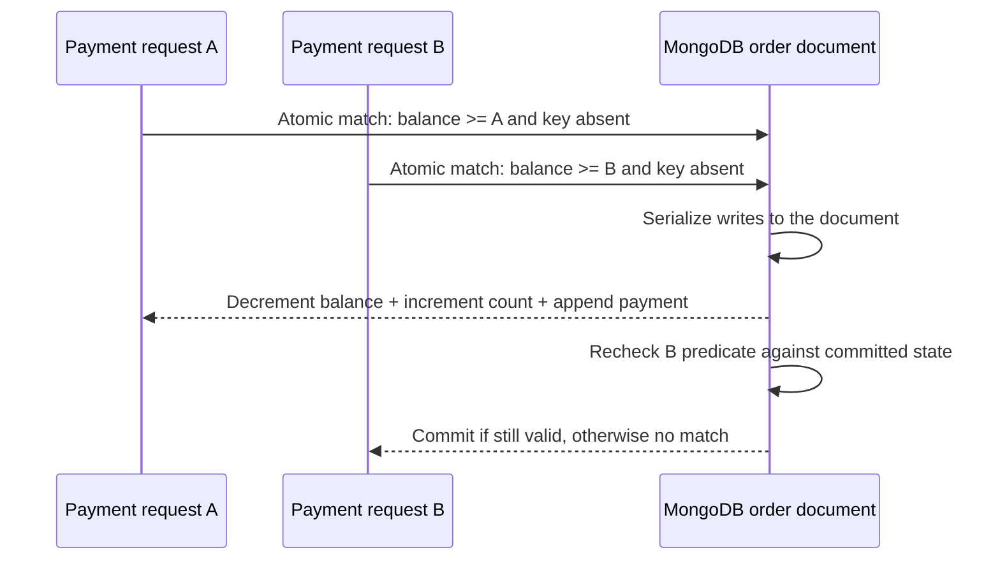
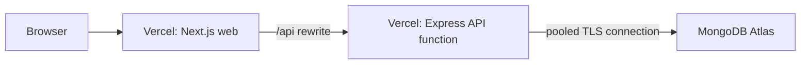

# Architecture

## 1. Purpose

This document defines the planned system structure and the boundaries that must remain stable during implementation. Product behavior belongs in `docs/PRODUCT_REQUIREMENTS.md` and `docs/DOMAIN_RULES.md`; endpoint and storage details belong in `docs/API.md` and `docs/DATABASE.md`.

## 2. Architectural goals

- Preserve financial correctness under concurrent requests.
- Make authentication and ownership difficult to bypass accidentally.
- Keep the application easy to understand in an interview.
- Provide a polished reviewer experience without hiding weak backend design behind UI work.
- Keep local setup, tests, and deployment simple.
- Avoid infrastructure that is not required by the assignment.

## 3. System context



The Next.js application never becomes the authoritative business layer. It presents data and gathers input; Express owns validation, authorization, calculations, state transitions, and atomic database operations.

## 4. Monorepo

The Phase 1 workspace and Phase 2 database foundation are implemented. Business modules below remain the approved target as their owning phases begin.

```text
crossval/
├── apps/
│   ├── api/
│   │   ├── src/
│   │   │   ├── app.ts
│   │   │   ├── index.ts
│   │   │   ├── server.ts
│   │   │   ├── config/
│   │   │   ├── db/
│   │   │   │   ├── client.ts
│   │   │   │   ├── collections.ts
│   │   │   │   ├── documents.ts
│   │   │   │   ├── object-id.ts
│   │   │   │   ├── seed.ts
│   │   │   │   ├── reset.ts
│   │   │   │   ├── validators/
│   │   │   │   ├── indexes/
│   │   │   │   └── migrations/
│   │   │   ├── errors/
│   │   │   ├── middleware/
│   │   │   ├── domain/
│   │   │   └── modules/
│   │   │       ├── auth/
│   │   │       ├── orders/
│   │   │       └── payments/
│   │   └── tests/
│   └── web/
│       ├── app/
│       ├── components/
│       │   ├── layout/
│       │   └── ui/
│       ├── features/
│       │   ├── auth/
│       │   └── orders/
│       └── lib/
├── packages/
│   └── contracts/
└── docs/
```

No `packages/ui`, generic repository package, or shared configuration package should be introduced initially.

## 5. Backend boundaries

### Express composition

`app.ts` constructs and exports the Express application without listening on a port. `server.ts` owns the local long-running listener. `index.ts` provides the deployment-compatible application export.

Middleware order:

1. Request ID.
2. Proxy/security configuration.
3. Safe response headers.
4. JSON body limits.
5. Origin/CORS policy.
6. Session authentication.
7. REST routes.
8. Not-found mapping.
9. Terminal error handler.

### Module structure

Each business module may contain:

```text
routes.ts       Express route registration
schemas.ts      transport validation
service.ts      business operation orchestration
mapper.ts       database-to-API representation
errors.ts       module error codes, when needed
```

Avoid controllers that only rename a service call and avoid a generic repository interface that hides MongoDB query patterns. Business services use typed collection handles from the official driver directly.

### Pure domain layer

Pure helpers should cover:

- Safe integer-cent calculations.
- Line and order totals.
- Date-only comparison.
- Order-status derivation.
- Idempotency request fingerprinting.

These helpers must not depend on Express or the MongoDB driver and should receive table-driven unit tests.

## 6. Frontend boundaries

The Next.js App Router provides layouts, route composition, and the authenticated shell. Client components are used where interactivity or React Query is required.

Frontend responsibilities:

- Render API representations.
- Collect and validate user-friendly form input.
- Convert decimal currency strings to cents before requests.
- Manage remote state through React Query.
- Preserve URL-backed table state.
- Present server conflicts and actionable recovery.
- Provide accessible, responsive interactions using Align UI.

Frontend non-responsibilities:

- Authoritative order totals.
- Authoritative remaining balances.
- Ownership decisions.
- Status persistence.
- Overpayment guarantees.

See `docs/FRONTEND.md` for the React Query design.

## 7. Data ownership and request flow

Every owned resource operation starts with an authenticated user ID derived from the session. The database query includes this ID rather than fetching globally and checking afterward.



Unowned and nonexistent orders are intentionally indistinguishable to callers and return 404.

## 8. Payment atomicity architecture

The selected strategy models an order, its line items, its materialized balance, and its bounded payment ledger as one MongoDB document. Payment creation uses one conditional `findOneAndUpdate`.



The operation performs:

1. Match order by `_id` and authenticated `userId`.
2. Require `balanceDueCents >= amount`.
3. Require that no embedded payment has the idempotency key.
4. Decrement `balanceDueCents` with `$inc`.
5. Increment `paymentCount` with `$inc`.
6. Append the prepared immutable payment with `$push`.
7. Set `updatedAt` and return the post-update document.

Order update and deletion use predicates containing `paymentCount: 0`. Because those writes target the same document, a first payment and edit/delete cannot both commit against the unpaid state.

Why this strategy:

- It is native to MongoDB's single-document atomicity model.
- Fields that must remain consistent live in one aggregate.
- The balance and ledger cannot partially update.
- Concurrent predicates are rechecked after another write changes the document.
- It avoids the cost and deployment constraints of a multi-document transaction.
- It visibly demonstrates MongoDB schema and query-pattern design.

## 9. Materialized balance

`Order.balanceDueCents` and `Order.paymentCount` are atomically maintained projections inside the order document.

```text
amountPaidCents = totalAmountCents - balanceDueCents
```

Benefits:

- Constant-time overpayment validation in the update predicate.
- Straightforward dashboard aggregates.
- Efficient paid/outstanding filtering.
- A MongoDB collection validator can enforce basic shape and balance bounds.

Cost:

- The payment ledger and balance can theoretically drift if a future write path bypasses the payment service.

Mitigation:

- One payment write path.
- Append-only payments.
- One atomic document update for ledger and projections.
- Restrictive database permissions in production.
- Integration tests that reconcile `total - balance`, `paymentCount`, and the embedded payment array.

If payment volume can grow without a practical bound, move payments to a separate collection and redesign consistency around a multi-document transaction or ledger service. That scale is outside this assignment.

## 10. Authentication architecture

Authentication uses opaque database-backed sessions:

- Argon2id password hashes.
- Random 256-bit session tokens.
- Only a SHA-256 session-token hash is stored.
- HttpOnly cookie carries the raw token.
- Logout deletes the Session record and clears the cookie.
- Session expiration is checked on every authenticated request.

Phase 3 implements this boundary in `apps/api/src/modules/auth`, with shared request/response contracts in `packages/contracts`. The Next.js app calls the public same-origin `/api/v1` path; `next.config.ts` rewrites it to the Express service configured by `API_INTERNAL_URL`. React Query owns current-viewer state, and protected client content is never rendered while the session request is unresolved.

Phase 4 implements the owned order boundary in `apps/api/src/modules/orders`: pure money/date/status helpers remain independent of Express and MongoDB, while the service uses ownership-led driver queries and conditional `paymentCount: 0` writes for edits and deletion. Static order routes are registered before `/:orderId`, and all order routes reuse the established session middleware.

Phase 5 extends the same module with the nested payment route. Payment preparation and request fingerprinting remain pure; the service performs one ownership-, balance-, capacity-, and idempotency-scoped `findOneAndUpdate`, then uses an owned diagnostic read only to explain an unmatched predicate. The web consumes committed state through React Query and never applies an optimistic financial update.

The primary deployment presents the API through the web origin, allowing `SameSite=Lax` cookies and simpler CSRF controls.

## 11. API and contract architecture

The public browser path is `/api/v1`, while Express internally mounts versioned routes under `/v1`.

`packages/contracts` is limited to:

- Zod request schemas expressed in API units.
- Response TypeScript types.
- Order-status values.
- Structured error codes.
- Pagination metadata.

UI currency-input schemas remain in the web app because they validate decimal strings, not integer-cent API payloads.

## 12. Deployment topology



Two Vercel projects point at separate monorepo applications. The web project proxies `/api/*` to the API project, providing one reviewer-facing origin. See `docs/DEPLOYMENT.md`.

## 13. Operational concerns

Initial observability remains intentionally small:

- Structured request logs with request ID, method, route, status, and duration.
- No secrets, session values, password fields, or payment notes in logs.
- Health endpoint that does not leak configuration.
- Deployment and database provider logs.
- Safe unexpected-error reporting with request IDs.

Production improvements may add centralized logs, metrics, traces, distributed rate limiting, session cleanup jobs, and automated balance reconciliation.

## 14. Scaling path

The take-home design is optimized for a small dataset but has a clear path forward:

- Add Atlas Search when customer search requirements exceed normalized prefix matching.
- Cache or precompute dashboard aggregates only when measured workload requires it.
- Add cursor pagination for very large order histories.
- Add a reconciliation job if payment writes come from multiple systems.
- Add amendments and audit actions instead of allowing paid-order mutation.
- Monitor order document growth; move an unbounded payment ledger to a referenced collection if needed.
- Keep the atomic consistency boundary per order; unrelated orders remain independently writable.

None of these are required for the initial submission.
