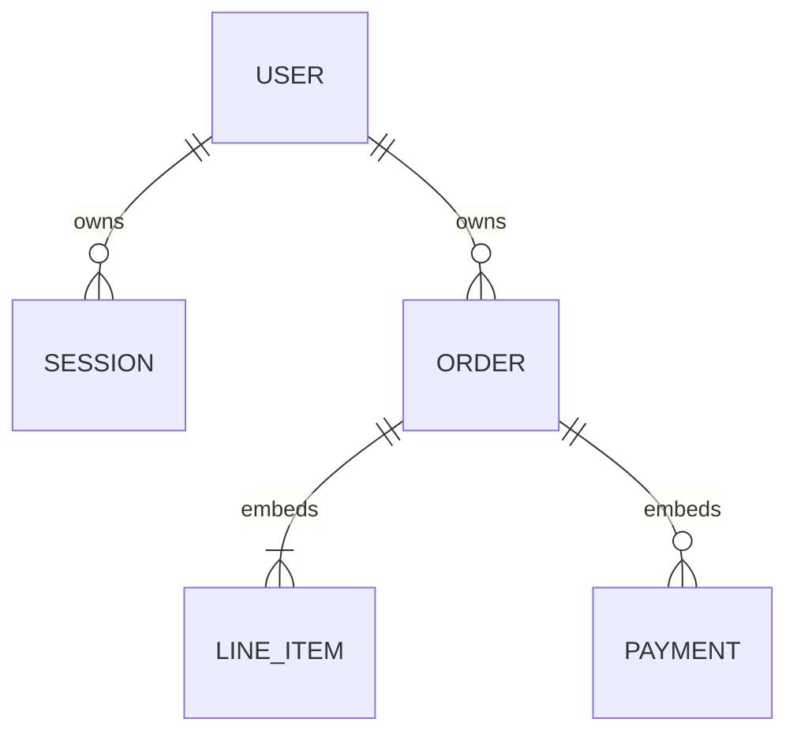

# MongoDB Data Design

## 1. Goals

- Demonstrate deliberate MongoDB schema, index, and query-pattern design.
- Preserve financial invariants under concurrent requests.
- Keep all fields that must change together inside one atomic aggregate.
- Enforce ownership in every query predicate.
- Make dashboard and order-detail reads efficient.
- Keep money and date-only values unambiguous.
- Avoid multi-document transactions when a stronger document boundary removes the need.

## 2. Technology choice

The application uses MongoDB Atlas through the official MongoDB Node.js driver 7.5.0. It does not use Prisma or another ORM/ODM.

Reasons:

- The official driver exposes MongoDB queries, projections, indexes, validators, and atomic update semantics directly.
- Zod validates HTTP and application boundaries while MongoDB collection validators defend stored document shape.
- Avoiding an ODM keeps the MongoDB-specific engineering decisions visible to reviewers.
- A single shared `MongoClient` supplies connection pooling for each API process.

Deployment uses MongoDB Atlas. Local development and integration tests use a real MongoDB server; tests create a unique `_test` database and drop only that generated database during cleanup.

## 3. Aggregate boundary

Collections:

```text
users
sessions
orders
schema_migrations
```

Line items and payments are embedded inside each order document.



The order is the consistency boundary because:

- line items exist only as part of an order;
- payments are recorded and displayed only through an order;
- balance, payment count, and payment history must change together;
- order detail requires the complete aggregate;
- the assignment's expected payment history is bounded and small.

MongoDB single-document writes are atomic. Embedding allows the payment ledger append and balance decrement to occur in one conditional update without a distributed transaction.

## 4. Identifier policy

- Top-level collection documents use MongoDB `ObjectId` values as `_id`.
- Embedded line items and payments also receive `ObjectId` values generated by the API before insertion.
- API responses serialize ObjectIds as 24-character lowercase hexadecimal strings.
- Request IDs and payment idempotency keys remain UUID strings because they identify requests, not stored MongoDB documents.
- Malformed ObjectId strings are rejected before database access.

## 5. Date and money representation

### Money

- All monetary values are BSON `int` values representing cents.
- The domain maximum remains `999999999` cents, safely inside BSON int32 and JavaScript safe-integer ranges.
- Quantity and multiplication bounds ensure calculated totals remain within the same maximum.
- No `double` or `decimal` value is accepted for authoritative money fields.

### Dates

- `dueDate` and `paymentDate` are canonical `YYYY-MM-DD` strings.
- Canonical fixed-width strings sort lexicographically in calendar order and avoid timezone conversion.
- `createdAt`, `updatedAt`, and `expiresAt` are BSON UTC dates.
- Overdue filters compare `dueDate` with a server-produced UTC date string.

## 6. User document

```text
{
  _id: ObjectId,
  email: string,
  passwordHash: string,
  createdAt: Date,
  updatedAt: Date
}
```

Rules:

- Email is trimmed and lowercased before persistence.
- `email` has a unique index.
- Password hashes are Argon2id outputs.
- Unknown fields are rejected by the collection validator.

## 7. Session document

```text
{
  _id: ObjectId,
  userId: ObjectId,
  tokenHash: string,
  expiresAt: Date,
  createdAt: Date
}
```

Rules:

- Only a SHA-256 digest of the opaque session token is stored.
- `tokenHash` is unique.
- `expiresAt` has a single-field TTL index with `expireAfterSeconds: 0`.
- Authentication still checks `expiresAt` directly because TTL removal is asynchronous.
- Sessions reference a user by `userId`; application workflows remove sessions when an account is intentionally deleted.

MongoDB does not provide foreign-key enforcement. Ownership and cleanup rules therefore remain explicit application responsibilities with integration tests.

Phase 3 implements user creation, credential lookup, session creation/rotation, token-hash lookup, direct expiration checks, logout deletion, and compensating user cleanup if initial session creation fails. The service uses the typed collection handles directly; no ODM or generic repository was added.

## 8. Order document

```text
{
  _id: ObjectId,
  userId: ObjectId,
  customerName: string,
  customerNameNormalized: string,
  dueDate: "YYYY-MM-DD",
  lineItems: [LineItem, ...],
  totalAmountCents: int,
  balanceDueCents: int,
  paymentCount: int,
  payments: [Payment, ...],
  createdAt: Date,
  updatedAt: Date
}
```

`status` and `paidAmountCents` are not stored.

Derived values:

```text
paidAmountCents = totalAmountCents - balanceDueCents
status = derive(balanceDueCents, paymentCount, dueDate, todayUTC)
```

`customerNameNormalized` is a lowercased, whitespace-normalized search projection. It is updated whenever the editable customer name changes.

## 9. Embedded line item

```text
{
  _id: ObjectId,
  description: string,
  quantity: int,
  unitPriceCents: int,
  position: int
}
```

Rules:

- At least one item exists.
- Quantity is an integer at least one and within the documented maximum.
- Unit price is a positive bounded integer.
- Positions are unique within the array and generated sequentially by the server.
- `lineTotalCents` is calculated for API responses and is not stored.

The complete array is replaced only while `paymentCount` is zero.

## 10. Embedded payment

```text
{
  _id: ObjectId,
  amountCents: int,
  paymentDate: "YYYY-MM-DD",
  note: string | null,
  idempotencyKey: string,
  requestFingerprint: string,
  createdAt: Date
}
```

Rules:

- Payments are positive, immutable, and append-only.
- Every payment has an idempotency key and normalized-request fingerprint.
- Future payment dates are rejected by the application boundary.
- Payment history is stored oldest-first; the API can return it newest-first through array reversal or an aggregation projection.

A unique multikey index does not enforce uniqueness between repeated array values inside the same order document. Payment idempotency is therefore enforced by the conditional atomic update, not claimed as an index guarantee.

## 11. Collection validators

Versioned setup scripts create or update validators using `collMod`.

Validators use:

- `$jsonSchema` for required fields, BSON types, array shapes, string lengths, integer bounds, and `additionalProperties: false` where operationally practical;
- query-expression validation for cross-field balance bounds when supported cleanly;
- `validationLevel: "strict"`;
- `validationAction: "error"`.

The implemented order validator enforces:

```text
totalAmountCents > 0
balanceDueCents >= 0
balanceDueCents <= totalAmountCents
paymentCount >= 0
paymentCount = payments.length
lineItems has at least one element
payments is an array
money fields are BSON integers
date-only strings match YYYY-MM-DD shape
totalAmountCents - balanceDueCents = sum(payments.amountCents)
```

Application validation remains necessary for semantic dates, normalized text, duplicate positions, ownership, and actionable error messages. The database validator repeats the core ledger equality as defense in depth.

## 12. Index catalogue

### Users

```text
users_email_unique: { email: 1 } unique
```

Supports registration and login.

### Sessions

```text
sessions_token_hash_unique: { tokenHash: 1 } unique
sessions_expires_at_ttl: { expiresAt: 1 } expireAfterSeconds: 0
sessions_user_id: { userId: 1 }
```

Supports session lookup, expiration, and user-session cleanup.

### Orders

Initial indexes follow actual query shapes:

```text
orders_user_created_at: { userId: 1, createdAt: -1, _id: -1 }
orders_user_due_balance: { userId: 1, dueDate: 1, balanceDueCents: 1 }
orders_user_payment_count_due_balance: { userId: 1, paymentCount: 1, dueDate: 1, balanceDueCents: 1 }
orders_user_customer_created_at: { userId: 1, customerNameNormalized: 1, createdAt: -1 }
```

Rationale:

- `userId` leads every owned query.
- The default order list sorts by newest creation time with an ObjectId tie-breaker for stable pagination.
- Overdue and due-date queries use owner, due date, and positive balance.
- Pending/partially-paid filters use owner plus payment count and date/balance conditions.
- Customer search uses a normalized anchored-prefix query so the index remains useful.

Indexes are not added for embedded payments initially because payment lookups are always scoped to a single order already located by `_id` and `userId`.

Before submission, integration tests run representative queries with `explain("executionStats")` to confirm intended index use. Indexes that do not serve a demonstrated query are removed.

## 13. Query catalogue

### Authenticate a session

1. Hash the cookie token.
2. Find `sessions` by unique `tokenHash` and require `expiresAt > now`.
3. Load the referenced public user fields.

### List orders

Filter every query by `userId`. Phase 4 uses an escaped anchored-prefix expression against `customerNameNormalized`, allowlisted public sorts, and a same-direction `_id` tie-breaker. It projects out `payments` and full line-item content because the dashboard needs only order-level values.

The list response derives `paidAmountCents` and status in the application mapper or aggregation pipeline from stored base facts.

### Order detail

Find one document by `_id` and `userId`, returning the embedded line items and complete payment history.

### Dashboard summary

Use an aggregation pipeline scoped by `userId` to calculate:

- total order count;
- sum of total amounts;
- sum of balances;
- collected amount from total minus balance;
- overdue balance using `dueDate < todayUTC` and positive balance.

### Status filters

```text
paid:
  balanceDueCents = 0

overdue:
  balanceDueCents > 0
  dueDate < todayUTC

pending:
  balanceDueCents > 0
  dueDate >= todayUTC
  paymentCount = 0

partially_paid:
  balanceDueCents > 0
  dueDate >= todayUTC
  paymentCount > 0
```

## 14. Atomic payment operation

Payment creation is one `findOneAndUpdate` against the order aggregate.

Preparation outside the write:

1. Validate transport fields.
2. Parse the owned order ObjectId.
3. Normalize payment date and note.
4. Generate the embedded payment ObjectId and timestamp.
5. Calculate the request fingerprint.
6. Check for an existing embedded payment with the idempotency key to support fast replay/conflict responses.

Atomic match predicate:

```text
_id = requested order
userId = authenticated user
balanceDueCents >= requested amount
no payment element has this idempotency key
paymentCount is less than 1,000
```

Atomic update:

```text
$inc:
  balanceDueCents by negative requested amount
  paymentCount by 1

$push:
  prepared payment document

$set:
  updatedAt
```

Request the post-update document from `findOneAndUpdate` and return that canonical committed state.

MongoDB rechecks the predicate for concurrent updates to the same document. If another payment reduces the balance first, an excessive second payment no longer matches. The balance decrement, payment count increment, and payment append are one atomic document write.

If no document matches, perform one targeted diagnostic read to distinguish:

- nonexistent or unowned order → `404 ORDER_NOT_FOUND`;
- same idempotency key and same fingerprint → replay original response;
- same key and different fingerprint → `409 IDEMPOTENCY_KEY_REUSED`;
- zero balance → `422 ORDER_ALREADY_PAID`;
- insufficient current balance → `422 PAYMENT_EXCEEDS_BALANCE` with current maximum;
- unexpected write failure → safe `503` or `500` according to retryability.
- full bounded ledger → `422 PAYMENT_LIMIT_REACHED`.

The diagnostic read explains the failure; it does not authorize a second financial write without reapplying the atomic predicate.

## 15. Atomic edit and delete rules

### Edit unpaid order

Use a single conditional update with:

```text
_id = requested order
userId = authenticated user
paymentCount = 0
```

The update replaces editable fields, normalized customer name, line items, total, balance, and timestamp together.

If a payment wins the race, `paymentCount` becomes positive and the edit no longer matches. If the edit wins, a later payment sees and settles against the new total. Both orders of execution preserve the documented rules.

### Delete unpaid order

Use `deleteOne` with the same `_id`, `userId`, and `paymentCount: 0` predicate.

If deletion wins, a concurrent payment matches no order. If payment wins, deletion no longer matches. No cascade is required because line items and payments are embedded.

## 16. Invariants and reconciliation

Always true:

```text
totalAmountCents = sum(quantity × unitPriceCents)
0 <= balanceDueCents <= totalAmountCents
paymentCount = payments.length
totalAmountCents - balanceDueCents = sum(payments.amountCents)
```

Safeguards:

- only the order service creates or edits unpaid orders;
- only the payment service appends a payment or changes settlement fields;
- collection validation protects shape and basic bounds;
- atomic predicates protect state-dependent writes;
- integration and concurrency tests re-read and assert all four invariants;
- a documented aggregation-based reconciliation command is added before submission.

At larger scale, run reconciliation periodically and alert on mismatches. Direct manual writes to production collections are outside normal operating procedure.

## 17. Document growth and boundary limit

MongoDB documents have a 16 MiB maximum. Embedded payments are accepted here because the assignment's order history is expected to remain small and is always consumed with the order detail.

Operational safeguards:

- impose a documented maximum number of line items;
- impose a deliberately high but finite payment-count limit for the MVP;
- project `payments` out of dashboard list queries;
- monitor average/max order document size in production;
- document that a high-volume ledger would move payments to a separate collection and use a transaction or different consistency design.

This tradeoff is explicit rather than presenting embedding as universally appropriate.

## 18. Setup, migrations, and seeds

MongoDB is schemaless by default, but this repository still treats database changes as versioned releases.

Phases 2 and 4 implement:

```text
apps/api/src/db/
├── client.ts
├── collections.ts
├── documents.ts
├── object-id.ts
├── validators/
├── indexes/
├── migrations/
│   ├── 003-add-order-sort-tiebreaker.ts
├── migrate.ts
├── reset.ts
├── safety.ts
├── seed-data.ts
└── seed.ts
```

Rules:

- setup/migration scripts are idempotent;
- validators and indexes have explicit stable names;
- `schema_migrations` records applied versions;
- destructive migrations require a backup and explicit authorization;
- index creation is tested against existing representative documents;
- seeds are separate from validators/migrations and use non-sensitive demo data;
- production database changes run once as a controlled release action.

Migration `003_add_order_sort_tiebreaker` rebuilds only `orders_user_created_at` with `{ userId, createdAt, _id }` so the implemented default list sort avoids a blocking winning-plan sort while preserving deterministic pagination.

Repository commands:

```text
pnpm db:migrate  apply pending migrations idempotently
pnpm db:seed     migrate and replace the dedicated development seed dataset
pnpm db:reset    drop/recreate only a database ending in _development or _test
```

## 19. Seed strategy

The implemented development seed uses dates relative to execution day:

- pending order due in seven days;
- partially paid order due in seven days;
- paid order with zero balance;
- unpaid overdue order due seven days ago;
- partially paid overdue order;
- assignment sample order with two 500.00 USD units and a 400.00 USD payment.

The seed must calculate all financial projections through the same domain helpers used by application writes and must pass reconciliation.

## 20. Deferred data modeling

Not included initially:

- separate Customer collection;
- separate Payment collection;
- multi-currency fields;
- refunds or reversals;
- audit-event collection;
- organization/tenant collection;
- sharding;
- change streams;
- Atlas Search;
- client-side field-level encryption.

Add these only when a product requirement supplies the necessary access patterns and invariants.

## 21. Official design references

- [MongoDB atomicity and transactions](https://www.mongodb.com/docs/manual/core/write-operations-atomicity/)
- [Model data for atomic operations](https://www.mongodb.com/docs/manual/tutorial/model-data-for-atomic-operations/)
- [Embedded data models](https://www.mongodb.com/docs/manual/data-modeling/embedding/)
- [Schema validation](https://www.mongodb.com/docs/manual/core/schema-validation/)
- [Indexing strategies](https://www.mongodb.com/docs/manual/applications/indexes/)
- [TTL indexes](https://www.mongodb.com/docs/manual/tutorial/expire-data/)
- [MongoDB Node.js connection pools](https://www.mongodb.com/docs/drivers/node/current/connect/connection-options/connection-pools/)
